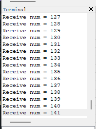

# Com_System 发布订阅系统

一个轻量级的嵌入式发布订阅通信系统，支持多对多的消息传递机制。
### TODO
- 支持队列绑定静态数组，优化内存查找及使用效率。
- 支持回调函数，接收到消息后自动调用。
- 将链表改成红黑树，提高查找效率。

### 发布者 (Publisher)
- 负责发布消息到指定话题
- 一个话题可以有多个发布者
- 发布的消息会广播给所有订阅该话题的订阅者

### 订阅者 (Subscriber)
- 订阅指定话题并接收消息
- 每个订阅者都有独立的消息队列
- 支持可选的消息接收回调函数
- 队列满时自动覆盖最旧的消息

### 循环队列 (Circular_Queue)
- 作为订阅者的消息缓冲区
- 支持任意数据类型
- 队列满时自动覆盖最旧数据

## API 接口

### 创建发布者
```c

/// @brief 创建一个发布者
/// @param topic_name 绑定的话题名称
/// @param data_len 传输数据结构大小
/// @return 建立完成的发布者指针
Publisher* Create_Publisher(const char* topic_name, uint8_t data_len);
```

### 创建订阅者(使用宏实现了类似Cpp的重载效果)
```c
/// @brief 创建一个订阅者
/// @param topic_name 绑定的话题名称
/// @param data_len 传输数据结构大小
/// @return 建立完成的订阅者指针
///@note 基础版本：默认队列大小为1
Subscriber* Create_Subscriber(const char* topic_name, uint8_t data_len);

/// @brief 创建一个订阅者
/// @param topic_name  绑定的话题名称
/// @param data_len 传输数据结构大小
/// @param queue_size 指定存储消息的队列大小
/// @note 如果队列满了,会自动覆盖最旧的数据
/// @return 建立完成的订阅者指针
Subscriber* Create_Subscriber(const char* topic_name, uint8_t data_len, uint8_t queue_size);

/// @brief 创建一个订阅者
/// @param topic_name 绑定的话题名称
/// @param data_len 传输数据结构大小
/// @param queue_size 指定存储消息的队列大小
/// @param callback 绑定一个回调函数，接收到消息自动进行调用
/// @note 还没写完，回调还没写
/// @return 建立完成的订阅者指针
Subscriber* Create_Subscriber(const char* topic_name, uint8_t data_len, uint8_t queue_size, void (*callback)(void*));
```

### 消息操作
```c
/// @brief 控制指定发布者向所有订阅者发布消息
/// @param publisher 发布者指针
/// @param data 发布数据指针
/// @return 调用是否成功
bool Publish_Message(Publisher* publisher, void* data);

/// @brief 从指定订阅者的队列中获取最新消息
/// @param subscriber 订阅者指针
/// @param data 获取数据指针
/// @return 调用是否成功
bool Get_Message(Subscriber* subscriber, void* data);
```


## 使用教程

### 1. 一个简单的使用示例

**代码示例:**


**运行结果:**



