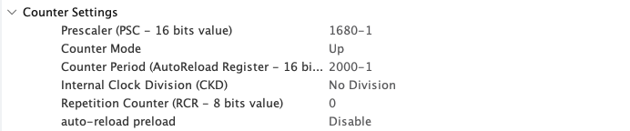

# 舵机-Servo模块

## 1.注意事项
1. 本模块配置有定时器参数**自动校正**功能，请正确在CubeMX中正确配置定时器参数，**真实的配置参数**请参考注册后`ServoInstance_s*`指向的实例中的以下成员变量
```c
uint32_t tim_Freq; // 定时器频率(Hz) 对应APB2定时器时钟
uint32_t tim_PRC; // 定时器预分频值
uint32_t tim_ARR; // 定时器自动重装载值
```
2. 目前仅兼容PWM控制频率在50Hz的舵机（之后会考虑兼容性问题）
3. 目前的角度映射需要根据舵机种类选择，默认映射是脉冲0.5-2.5ms对应0-pi

## 2. 使用例程
1. CubeMX配置：(此处的配置需要舵机的控制频率为50Hz)
    - 将PCR预分频器配置为**APB定时器时钟频率\*10 - 1**
    - 将ARR自动重装载值配置为**2000 - 1**
    - CubeMX实际配置：
2. 代码实现
```c
ServoInitConfig_s servo_config = {
    .type = SERVO_NORMAL,
    .tim_handle = &htim1,
    .channel = TIM_CHANNEL_1, // 使用TIM1的通道1
};
ServoInstance_s *servo = NULL;

float angle = 0.0f;

void App_DebugTask(void const * argument)
{
    servo = Servo_Register(&servo_config);

    while (1) {
        Servo_Control(servo, angle);//通过修改angle变量来控制舵机角度
        osDelay(1);
    }
}
```
