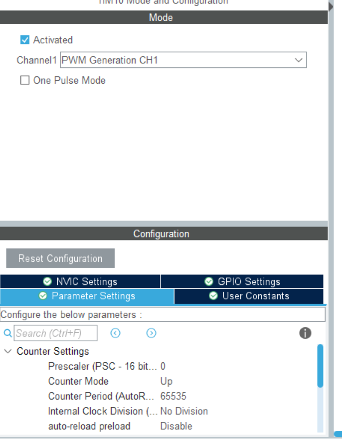
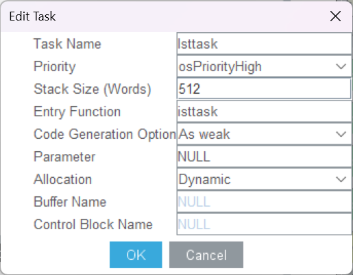

# 这是IMU的任务文件
IMU库 基于 Fusion算法开发，包含BMI088库，IST8310库和一系列底层BSP库。整个解算过程已经打包为APP文件，引入即可使用。  
本库坐标系为NWU（北西上）  
## 使用说明
在使用之前，确保你引进了所有库中的文件，并且正确包含了arm_math.h
1.在CubeMX中开启TIM10CH1的PWM通道，配置如下:  

2.在CubeMX中添加任务如图

3.在main.c中在操作系统启动前加入Dwt_Init(168);
4.陀螺仪解算数据储存于Quater结构体中。  
例如使用yaw轴数据控制:  
```
target_speed=Pid_Calculate(Down_yaw->angle_pid,target_position,Quater.yaw);
```
## 注意事项
C板体质不同，恒温PID可能出现问题，需要在`PidInitConfig_s temp_pid_config`中调参;  
如若要使用角度值而非弧度制，将第 363 行的` FusionEuler fe = FusionQuaternionToEulerRad(fq);` 改为` FusionEuler fe = FusionQuaternionToEuler(fq);`  
初始化需要温度达到40度，并且依然有较长的初始化时间，在后面的更新中会逐步改进。此外提供了ready_flag在Quater中可供使用。