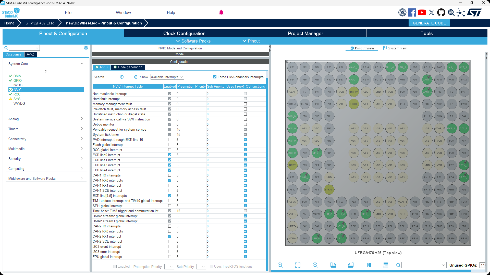
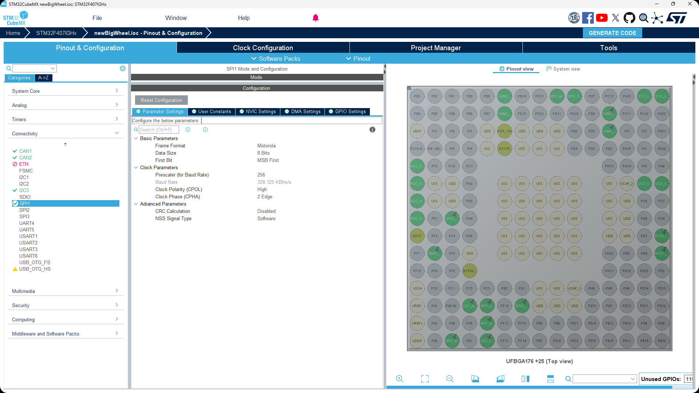
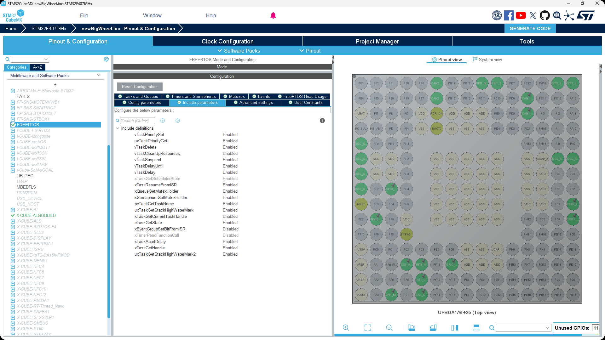

临时姿态解算使用指南

## 前言

由于姿态解算难度较大，封库的同学需要多花很多时间去研究相关内容，故正式版封好还有一段时间。但是考虑姿态解算关系到小陀螺，自瞄控制等功能的开发，属于比较重要的模块，所以在这里提供一个从老代码中移植过来的临时非正式的姿态解算Task

## 食用指南1:CUBEMX配置

### CUBEMX

照着图片一模一样配置即可

图一：GPIO配置

注意要一模一样，包括命名和上下拉模式都要保证一模一样，所有引脚都要开启

图二：NVIC配置

开启EXTI line0、1、3、4、[9:5]（请忽略图片中can相关的中断）

图三：I2C配置

开启 `Fast Mode`，其余保持默认不变

图四：SPI引脚

图五：SPI配置

注意 `Clock Parameters` 的配置

图六：SPI的DMA配置

注意SPI_Rx 是`DMA2 Steam 2`两者都是普通模式而非循环模式

图七：FreeRTOS的include parameters配置

能开就开

图八：FreeRTOS任务配置参考

函数入口即 `InsTask`支持自定义，但是在 <IMU_Task.c>中要做修改

